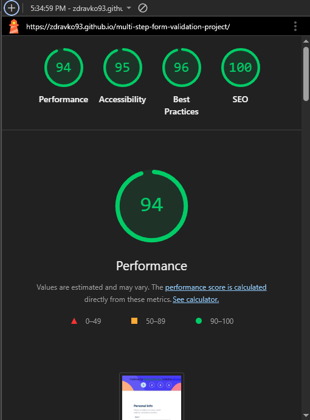
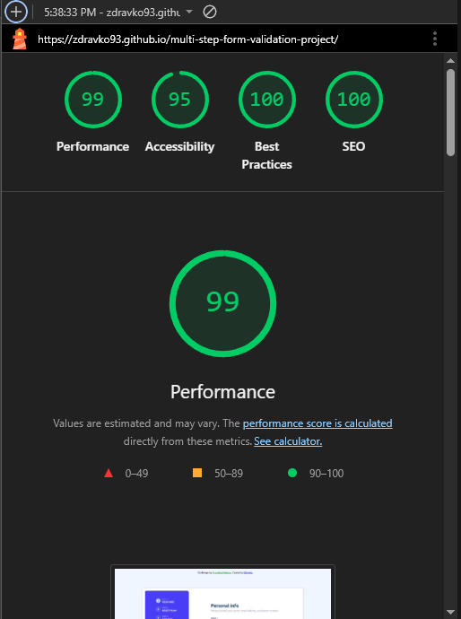

# Multi-Step Form | Frontend Mentor Challenge Solution

A responsive, accessible, and interactive multi-step form built with HTML, CSS, and JavaScript. This project demonstrates professional front-end development skills, including real-time form validation, user-friendly UX, semantic markup, and responsive design for all device sizes.

## Table of Contents

- [Overview](#overview)
- [Features](#features)
- [Tech Stack](#tech-stack)
- [Screenshot](#screenshot)
- [Links](#links)
- [Installation & Usage](#installation-and-usage)
- [Project Goals](#project-goals)
- [Contributing](#contributing)
- [Contact](#contact)
- [Author](#author)

## Overview

This dynamic multi-step form guides users through a structured, intuitive process of inputting personal and billing information. It features:

- Real-time validation
- Visual progress tracking
- Responsive Layout

ensuring a smooth and engaging experience across desktop, tablet, and mobile devices.

### Features

- Multi-Step Flow: Breaks forms into manageable steps for a clear user journey
- Real-Time Validation: Instant input feedback to prevent errors
- Progress Tracker: Sidebar highlights current and upcoming steps
- Responsive Design: Fully optimized for all device sizes
- Accessible UI: Semantic HTML and ARIA attributes for improved usability
- Error Handling: Clear and user-friendly error states

### Tech Stack

- HTML5: Semantic structure and accessible markup
- CSS3: Modern styling using Flexbox and responsive techniques
- JavaScript: Handles navigation, validation, and dynamic state management

### Screenshot


### Lighthouse Report

This project was audited using Google Lighthouse for both mobile and desktop performance.

**Mobile Scores**:

- Performance: 94
- Accessibility: 95
- Best Practices: 96
- SEO: 100



**Desktop Scores**:

- Performance: 99
- Accessibility: 95
- Best Practices: 100
- SEO: 100



⚡ These scores demonstrate that the project is optimized for speed, accessibility, best practices, and SEO, ensuring a high-quality user experience on all devices.

### Links

- Solution URL: [Github Repository](https://github.com/Zdravko93/multi-step-form-validation-project)
- Live Site URL: [Live Demo](https://zdravko93.github.io/multi-step-form-validation-project/)

## Installation

1. Clone the repository:

```bash
git clone https://github.com/Zdravko93/multi-step-form-validation-project.git
```

2. Open the project:
   Navigate to the project folder and open index.html in your browser.

## Usage

1. Open `index.html` in your preferred web browser
2. Complete each step by entering the required information
3. Real-time validation ensures that all inputs are correct before proceeding
4. After the final confirmation, a success message is displayed

## Project Goals

This project highlights my focus on:

- Building interactive and accessible front-end interfaces
- Implementing real-time form validation with clear feedback
- Writing maintainable, semantic, and scalable front-end code
- Designing responsive, user-centered layouts

## Contributing

Contributions and suggestions are welcome.
To contribute, fork the repository and submit a pull request with your improvements.

## Contact

Connect or reach out for collaboration opportunities:

- LinkedIn: [LinkedIn](https://www.linkedin.com/in/zdravkodelic/)
- GitHub - [Zdravko93](https://github.com/Zdravko93)
- Frontend Mentor - [@Zdravko93](https://www.frontendmentor.io/profile/Zdravko93)

## Author

**Zdravko Delic** – Front-End Developer passionate about **clean design**, **accessibility**, and creating **intuitive digital experiences**.
